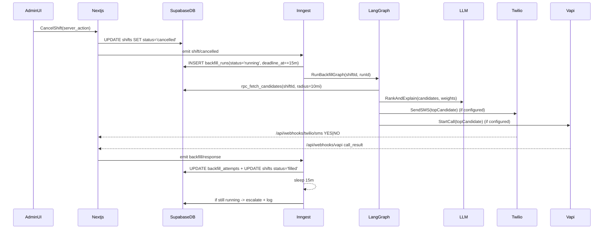

# Low-Level Design (LLD): Shift Backfilling (Vali Health Prototype)

This document describes the **implementation-level design** for the Shift Backfilling workflow in this repo: a reactive, event-driven system that coordinates **database + LLM + voice/SMS** to fill last-minute home-care shifts.

## Objectives

- **React immediately** to a shift cancellation event (no polling).
- **Deterministically filter** eligible caregivers (geo + availability + mandatory skills) in Postgres.
- **Rank and explain** candidates using an LLM (with a deterministic fallback).
- **Initiate outreach** via SMS/voice, and **process YES/NO** responses.
- **Escalate** to a human manager if no acceptance before a deadline.
- **Log every decision** and sensitive step (audit trail) and **minimize PHI** in prompts.

## System overview

### Key components (as implemented)

| Component | Responsibility | Implementation |
|---|---|---|
| Event Gateway | Turn “cancel shift” into an event | Server action `cancelShift` emits Inngest event |
| Orchestrator | Durable execution, retries, deadline sleep | Inngest function `backfill-on-shift-cancelled` |
| Brain | Multi-step state machine | LangGraph state graph |
| Matching Engine | Geo + eligibility filters | Supabase/Postgres RPC + PostGIS |
| Comms Layer | SMS/Voice + webhooks | Twilio + optional Vapi + Next route handlers |
| Compliance Layer | PHI minimization + audit log | `phi.ts` + `system_audit` table |

### High-level sequence

## Data model (Supabase/Postgres)

The DB is designed to separate **core scheduling entities** from **operational backfill state** and **audit logs**.

### Core tables

- `clients`: PHI-minimized identifiers are used in prompts (`first_name`, `last_initial`). Location is used for proximity.
- `caregivers`: skills, location, status.
- `shifts`: client, optional caregiver assignment, required skills, time window, status.

### Operational tables

- `caregiver_stats`: reliability features used by ranking.
- `backfill_runs`: durable “attempt to fill a shift”, including deadline and chosen caregiver.
- `backfill_attempts`: each outreach attempt (sms/voice), provider IDs, outcome.

### Compliance tables

- `system_audit`: append-only “why/what happened” log entries.

### Migrations

- Schema: `supabase/migrations/0001_init.sql`
- Candidate RPC: `supabase/migrations/0002_rpc_fetch_candidates.sql`

## Matching Engine (DB-first)

### Why DB-first

The system must enforce **hard constraints** deterministically:
- “active” caregivers only
- no schedule overlap
- within geo radius
- has mandatory skills

These rules should not depend on an LLM.

### RPC: `rpc_fetch_candidates`

Returns candidate rows with:
- `distance_miles` (PostGIS distance)
- `skills_overlap`, `has_mandatory_skills`
- `reliability_score`, `last_minute_accept_rate`
- `language_match`

This RPC is invoked by:
- `src/lib/backfill/fetchCandidates.ts`

## Brain (LangGraph state machine)

### Purpose

LangGraph provides an explicit and testable workflow graph:
- deterministic steps (DB lookups)
- probabilistic step (LLM ranking)
- branching (`execute_outreach` vs `escalate`)

### Nodes (as implemented)

| Node | Responsibility | File |
|---|---|---|
| `analyze_vacancy` | Load shift + client context | `src/lib/backfill/analyzeVacancy.ts` |
| `fetch_candidates` | Call Postgres RPC | `src/lib/backfill/fetchCandidates.ts` |
| `rank_candidates` | Weighted score + explanation via LLM (fallback if no API key) | `src/lib/backfill/rankCandidates.ts` |
| `execute_outreach` | Create outreach attempt, send SMS/call (or simulate) | `src/lib/backfill/outreach.ts` |
| `escalate` | Mark run escalated and notify manager (if configured) | `src/lib/backfill/escalate.ts` |

Graph wiring:
- `src/lib/backfill/graph.ts`

### Candidate ranking weights

The prototype implements the requested weighting:

- Distance: 40%
- Skill match: 30%
- Reliability: 20%
- Language: 10%

Hard rule: **if `hasMandatorySkills=false`, final score must be 0** (enforced in prompt + fallback).

## Orchestration (Inngest)

### Why an orchestrator is required

Backfilling needs:
- retries (webhook failures, transient DB errors)
- idempotency (duplicate cancellation events)
- durable sleeps/timers (escalate after 15 minutes)

In serverless environments, you can’t rely on a single request staying alive.

### Inngest function flow

- Event: `shift/cancelled`
- Steps:
  1. `dedupe-active-run`
  2. `create-run`
  3. `run-langgraph`
  4. `sleep 15m`
  5. `escalate-if-still-running`

Implementation:
- `src/lib/inngest/functions.ts`
- Endpoint: `src/app/api/inngest/route.ts`

## Communications layer

### Outbound

- SMS:
  - `src/lib/comms/twilio.ts`
  - Called from `src/lib/backfill/outreach.ts`
- Voice (optional):
  - `src/lib/comms/vapi.ts`
  - Called from `src/lib/backfill/outreach.ts`

### Inbound webhooks

- Twilio inbound SMS:
  - `POST /api/webhooks/twilio/sms` → emits `backfill/response`
  - `src/app/api/webhooks/twilio/sms/route.ts`
- Vapi inbound call result:
  - `POST /api/webhooks/vapi` → emits `backfill/response`
  - `src/app/api/webhooks/vapi/route.ts`

### Response normalization

Responses are normalized to:
- `accepted`
- `declined`
- `no_answer`

The canonical handler is:
- `src/lib/backfill/processResponse.ts`

## Compliance & safety

### PHI minimization

- LLM prompts and caregiver messages use **FirstName + LastInitial** only.
- Helper:
  - `src/lib/phi.ts`

### Audit logging

Each critical step writes to `system_audit`, including:
- ranking decisions (`backfill.rank.*`)
- outreach attempts (`backfill.outreach.*`)
- accept/decline (`backfill.response.*`)
- escalation (`backfill.escalate`)

Writer:
- `src/lib/backfill/audit.ts`

## UI roles (recruiter demo)

The prototype uses a single Next.js app with three “role” pages:

- Admin: `/admin`
- Caregiver: `/caregiver` (accept/decline offers via UI)
- Client/Caretaker: `/client`

These are intentionally separate to demonstrate real product surfaces without requiring multiple services.

## Configuration

See `.env.example` for required values:

- Supabase: `SUPABASE_URL`, `SUPABASE_SERVICE_ROLE_KEY`
- Inngest: `INNGEST_EVENT_KEY`, `INNGEST_SIGNING_KEY`
- Twilio: `TWILIO_ACCOUNT_SID`, `TWILIO_AUTH_TOKEN`, `TWILIO_FROM_NUMBER`
- Optional: `OPENAI_API_KEY`, `VAPI_*`, `MANAGER_PHONE_NUMBER`

## Operational notes

- Use a dedicated outbox/attempt model (`backfill_attempts`) for traceability and retries.
- For production: enforce idempotency keys per `(shift_id, run_id)` and ensure webhook deduplication.
- For SMS in the US: ensure A2P 10DLC compliance or use toll-free/short code per carrier rules.

